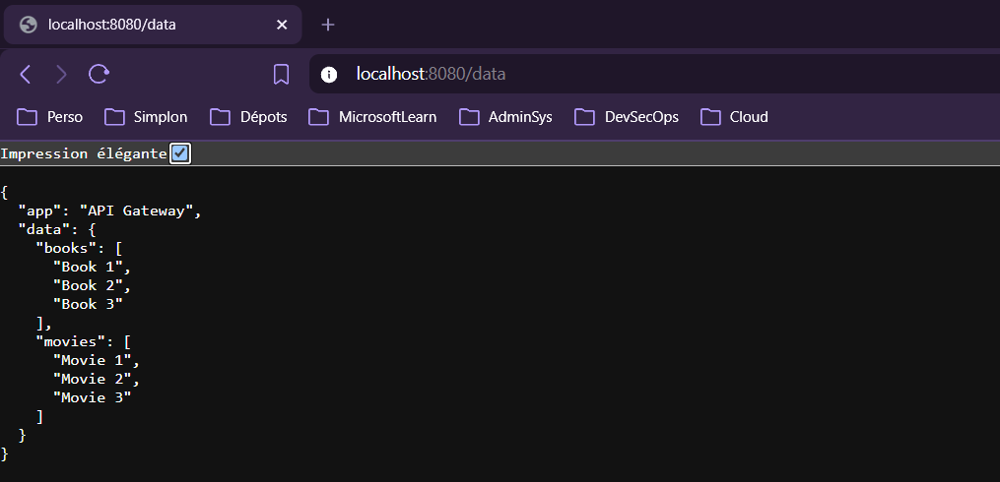

#  Kubernetes &amp; Golang microservices 

Deploying a Go microservices application on Kubernetes (kind), in high availability, with the API Gateway exposed through a LoadBalancer service.

## Architecture

Three Go applications, built from a **single Docker image** (three binaries inside), each selected at runtime by the container `command`.

```
   OUTSIDE (http://localhost:8080/data)
        |
        v   LoadBalancer (cloud-provider-kind)
   ┌─────────┐   internal    ┌──────────┐
   │   api   │ ───────────►  │  books   │  (ClusterIP, internal only)
   │ Gateway │ ───────────►  │  movies  │  (ClusterIP, internal only)
   └─────────┘               └──────────┘
   exposed outside          not reachable from outside
```

- **api**: API Gateway, exposed outside via a `LoadBalancer` service. Aggregates books + movies.
- **books**: books service, `ClusterIP` (internal only).
- **movies**: movies service, `ClusterIP` (internal only).

The API reaches the two services by their **Service DNS name**, injected as environment variables:

- `BOOKS_API_HOST=books`
- `MOVIES_API_HOST=movies`

(The port is 80, the default HTTP port, so no port suffix is needed. The Go code calls `http://books/books` and `http://movies/movies`.)

## Endpoints

| App | Endpoint | Response |
|---|---|---|
| api | `GET /data` | aggregated JSON (books + movies) |
| books | `GET /books` | `{"app":"Books API","data":[...]}` |
| movies | `GET /movies` | `{"app":"Movies API","data":[...]}` |

Note: the API serves on `/data`, **not** on `/`. `http://localhost:8080/` returns 404, `http://localhost:8080/data` returns the aggregated payload.

## Requirements

- Docker
- kind
- kubectl
- Go (to build cloud-provider-kind)
- cloud-provider-kind (provides LoadBalancer support on kind)

Install cloud-provider-kind:

```bash
go install sigs.k8s.io/cloud-provider-kind@latest
```

## Project layout

```
kind-config.yaml            # cluster: 1 control-plane + 2 workers
Dockerfile                  # single image, 3 binaries
cmd/{api,books,movies}      # Go sources
k8s/
  api/     api-deployment.yaml     api-service.yaml     (LoadBalancer)
  books/   books-deployment.yaml   books-service.yaml   (ClusterIP)
  movies/  movies-deployment.yaml  movies-service.yaml  (ClusterIP)
```

## Deploy

**1. Create the cluster** (1 control-plane + 2 workers, no app on the control-plane)

```bash
kind create cluster --name microservices --config kind-config.yaml
```

**2. Build the image and load it into the cluster**

```bash
docker build -t microservices:1.0 .
kind load docker-image microservices:1.0 --name microservices
```

**3. Deploy all manifests**

```bash
kubectl apply -R -f k8s/
```

**4. Start cloud-provider-kind** (leave it running in its own terminal)

```bash
sudo cloud-provider-kind
```

The API service then gets an `EXTERNAL-IP`:

```bash
kubectl get svc api
```

## Access

```bash
curl http://localhost:8080/data
```

Expected response:

```json
{
  "app": "API Gateway",
  "data": {
    "books": ["Book 1", "Book 2", "Book 3"],
    "movies": ["Movie 1", "Movie 2", "Movie 3"]
  }
}
```

## WSL2 note (LoadBalancer)

On WSL2, cloud-provider-kind may assign the LoadBalancer IP to the host loopback (`lo`). When that happens, the host treats the IP as local and `localhost:8080` hangs. Fix it by removing the address from loopback:

```bash
sudo ip addr del <EXTERNAL-IP>/32 dev lo
```

If cloud-provider-kind re-adds it during a later sync and access breaks again, run the command again.

## Cleanup

```bash
kind delete cluster --name microservices
```

## Brief

See [docs/CONSIGNES.md](docs/CONSIGNES.md).

## Result


